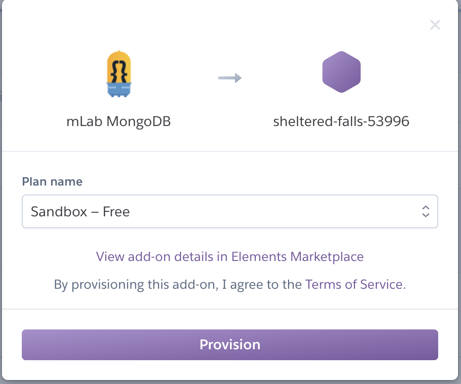
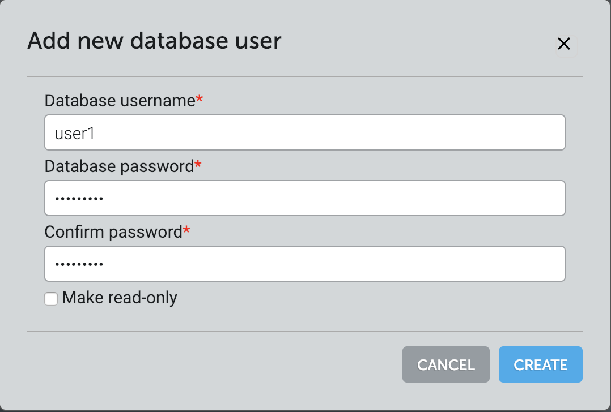

# How to Deploy your MongoDB Application to Heroku

[Deployment Video Guide](https://youtu.be/2E8eWUHJaNg?list=PLOFmg4xbN_TPrB6w4rThsFanVxJI_SfER).

* In this guide we will walk through the steps required to deploy your MongoDB Application with Heroku.

## Part One: Provision an mLab Remote Database

**NOTE**: At this point, we'll be assuming you have been pushing/pulling your code to and from GitHub but have not yet deployed your application to Heroku.

1. Open your Terminal/GitBash and `cd` into your project directory.

2. Once in your project directory, type in `heroku create`.

* 

3. Navigate to [Heroku](https://www.heroku.com) and login with your credentials.

4. Find your Heroku Apps name within your dashboard and click on it.

5. Look for the Add-Ons section within your applications dashboard. In the text field search for `mLab`. This will bring up the `mLab Mongo` add-on, click to add it to your application.

* 

6. Clicking on `mLab MongoDB` will bring up a modal asking you if you'd like to provision a specific tier plan.

7. Be sure you are selecting the free option, and click `Provision`.

## Part Two: Connecting your MongoDB Project with mLab

1. On the resources tab, click the newly provisioned mLab MongoDB link, which will bring you to your mLab Dashboard for this app.

2. Go to the users tab, and click on `Add database user`.

3. You can make the username/password whatever you would like, just be sure to remember it! In the example we chose `user1` as the username and `password1` as our password.

4. Now that we have provisioned our add-on, Heroku will set our environmental variables for us to connect to the DB via the `MONGODB_URI`

* Make sure you have this line of code within your `server.js` file.

5. Now lets `git add`, `git commit` and `git push origin main`. After we complete our push to GitHub, lets push to Heroku! In our terminal/gitbash, enter `git push heroku main`.

6. Once complete, running `heroku open --app YOURAPPNAME` in your terminal/gitbash will open your Heroku app in browser.
